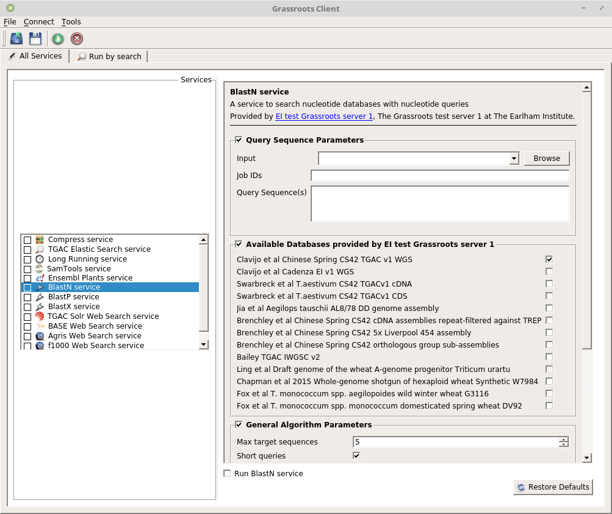

User Guide {#user_guide}
==========

A Grassroots Server can be accessed in a number of ways such as using the Qt-based desktop client application, a web browser or from the command line. 

## Desktop client

The desktop client uses [Qt](https://www.qt.io/) which is a cross-platform toolkit allowing
the same client to be used on Windows, Linux, macOS, AmigaOS4, *etc.*

